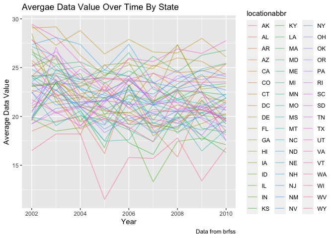
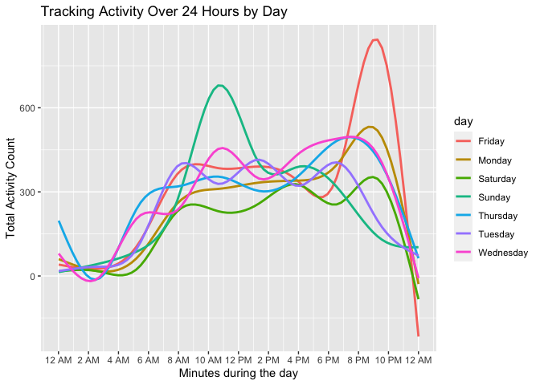

hw3\_jhk2201
================
joseph Kim
10/18/2021

### Problem 1 (Description of Instacart Data)

## How many aisles are there, and which aisles are the most items ordered from?

``` r
max(instacart$aisle_id)
```

    ## [1] 134

``` r
instacart1 <- instacart %>%
  group_by(aisle) %>% 
  summarise(order_amount=n()) %>% 
  arrange(desc(order_amount)) 
```

There are 134 total aisles listed in the dataframe. The aisle with the
most items ordered from was fresh vegetables which had a count of
150609.

``` r
instacart2 <- filter(instacart1, order_amount>10000) %>% 
arrange(desc(order_amount)) 

ggplot(instacart2, aes(x = aisle, y = order_amount)) + geom_bar(stat="Identity") +
coord_flip() + labs(title = "Number of Items Ordered for Aisle Greater than 10,000")
```

<!-- -->

``` r
instacart %>%
      filter(aisle %in% c("baking ingredients", "dog food care", "packaged vegetables fruits")) %>%
      group_by(aisle, product_name) %>%
      summarize(amount_product = n()) %>%
      arrange(aisle, desc(amount_product)) %>%
      filter(min_rank(desc(amount_product)) <4) %>%
      knitr::kable(digits = 1, caption = "The Top Three Most Popular Items Sold in ")
```

    ## `summarise()` has grouped output by 'aisle'. You can override using the `.groups` argument.

| aisle                      | product\_name                                 | amount\_product |
|:---------------------------|:----------------------------------------------|----------------:|
| baking ingredients         | Light Brown Sugar                             |             499 |
| baking ingredients         | Pure Baking Soda                              |             387 |
| baking ingredients         | Cane Sugar                                    |             336 |
| dog food care              | Snack Sticks Chicken & Rice Recipe Dog Treats |              30 |
| dog food care              | Organix Chicken & Brown Rice Recipe           |              28 |
| dog food care              | Small Dog Biscuits                            |              26 |
| packaged vegetables fruits | Organic Baby Spinach                          |            9784 |
| packaged vegetables fruits | Organic Raspberries                           |            5546 |
| packaged vegetables fruits | Organic Blueberries                           |            4966 |

The Top Three Most Popular Items Sold in

instacart %&gt;% mutate(order\_dow = recode(order\_dow, ‘0’ = ‘Sunday’,
‘1’ = ‘Monday’, ‘2’ = “Tuesday”, ‘3’ = “Wednesday”, ‘4’ = “Thursday”,
‘5’ = “Friday”, ‘6’ = “Saturday”)) %&gt;% group\_by(product\_name,
order\_dow) %&gt;% filter(product\_name %in% c(“Pink Lady Apples”,
“Coffee Ice Cream”)) %&gt;% summarize(mean\_hour\_order =
mean(order\_hour\_of\_day)) %&gt;% pivot\_wider(instacart, names\_from =
order\_dow, values\_from = product\_name)


    ```r
    data("brfss_smart2010")

    behavioral_health = brfss_smart2010 %>%
        janitor::clean_names() %>%
        filter(topic == "Overall Health") %>%
        filter(response %in% c("Excellent", "Very Good", "Good", "Fair", "Poor")) %>%
        mutate(response = as.factor(response)) %>%
        mutate(response = forcats::fct_relevel(response, c("Poor", "Fair", "Good", "Very good", "Excellent")))

    ## Warning: Unknown levels in `f`: Very good

``` r
data("brfss_smart2010")

behavioral_health2002 = behavioral_health %>%
  filter(year == 2002) %>%
  group_by(locationabbr) %>%
  summarize(count = n_distinct(locationdesc)) %>%
  filter(count >= 7)

behavioral_health2010 = behavioral_health %>%
  filter(year == 2010) %>%
  group_by(locationabbr) %>%
  summarize(count = n_distinct(locationdesc)) %>%
  filter(count >= 7)
```

In 2002, there were six states that were observed at 7 or more locations
(CT, FL, MA, NC, NJ, PA). In 2021, there were 14 states that fit the
above criteria (CA, CO, FL, MA, MD, NC, NE, NJ, NY , OH, PA, SC, TX,
WA).

``` r
behave_excellent = behavioral_health %>%
  filter(response == "Excellent") %>%
  group_by(year, locationabbr) %>%
  summarize(avg_datavalue = mean(data_value, na.rm = TRUE)) 
```

    ## `summarise()` has grouped output by 'year'. You can override using the `.groups` argument.

``` r
ggplot(behave_excellent, aes(x = year, y = avg_datavalue, color = locationabbr)) + geom_line(aes(group = locationabbr), alpha =0.5) + labs(
    title = "Avergae Data Value Over Time By State",
    x = "Year",
    y = "Average Data Value",
    caption = "Data from brfss"
  )
```

<!-- -->

``` r
plot_data = behavioral_health %>%
  filter(locationabbr == "NY") %>%
  filter(year %in% c("2006", "2008"))
  
ggplot(plot_data, aes(x=response, y=data_value)) + 
  geom_col() + facet_grid(~year) + labs(
    title = "Data_Value Counts for Response Types, By Year",
    x = "Response Types",
    y = "Data Values (%)",
    caption = "Data from brfss") 
```

<!-- -->

``` r
accelerometer_df=
  read_csv("/Users/josephkim/Desktop/p8106_hw3_jhk2201/accel_data.csv") %>%
  janitor::clean_names() %>%
    pivot_longer(
    activity_1:activity_1440,
    names_to = "minute_count", 
    values_to = "activity_count",
    names_prefix = "activity_") %>%
    mutate(
      week = as.integer(week), 
      day_id = as.integer(day_id), 
      minute_count = as.integer(minute_count), 
      weekend_weekday = case_when(
           day %in% c("Monday", "Tuesday", "Wednesday", "Thursday", "Friday") ~ "Weekday",
           day %in% c("Saturday", "Sunday") ~ "Weekend")) %>%
      relocate(weekend_weekday,.after = day)
```

    ## Rows: 35 Columns: 1443

    ## ── Column specification ────────────────────────────────────────────────────────
    ## Delimiter: ","
    ## chr    (1): day
    ## dbl (1442): week, day_id, activity.1, activity.2, activity.3, activity.4, ac...

    ## 
    ## ℹ Use `spec()` to retrieve the full column specification for this data.
    ## ℹ Specify the column types or set `show_col_types = FALSE` to quiet this message.

``` r
agg.accel_df = accelerometer_df %>%
  group_by(week, day) %>%
  summarize(total_activity = sum(activity_count)) %>%
  knitr::kable(caption = "Total Activity Per Day of the Week")
```

    ## `summarise()` has grouped output by 'week'. You can override using the `.groups` argument.

``` r
agg.accel_df
```

| week | day       | total\_activity |
|-----:|:----------|----------------:|
|    1 | Friday    |       480542.62 |
|    1 | Monday    |        78828.07 |
|    1 | Saturday  |       376254.00 |
|    1 | Sunday    |       631105.00 |
|    1 | Thursday  |       355923.64 |
|    1 | Tuesday   |       307094.24 |
|    1 | Wednesday |       340115.01 |
|    2 | Friday    |       568839.00 |
|    2 | Monday    |       295431.00 |
|    2 | Saturday  |       607175.00 |
|    2 | Sunday    |       422018.00 |
|    2 | Thursday  |       474048.00 |
|    2 | Tuesday   |       423245.00 |
|    2 | Wednesday |       440962.00 |
|    3 | Friday    |       467420.00 |
|    3 | Monday    |       685910.00 |
|    3 | Saturday  |       382928.00 |
|    3 | Sunday    |       467052.00 |
|    3 | Thursday  |       371230.00 |
|    3 | Tuesday   |       381507.00 |
|    3 | Wednesday |       468869.00 |
|    4 | Friday    |       154049.00 |
|    4 | Monday    |       409450.00 |
|    4 | Saturday  |         1440.00 |
|    4 | Sunday    |       260617.00 |
|    4 | Thursday  |       340291.00 |
|    4 | Tuesday   |       319568.00 |
|    4 | Wednesday |       434460.00 |
|    5 | Friday    |       620860.00 |
|    5 | Monday    |       389080.00 |
|    5 | Saturday  |         1440.00 |
|    5 | Sunday    |       138421.00 |
|    5 | Thursday  |       549658.00 |
|    5 | Tuesday   |       367824.00 |
|    5 | Wednesday |       445366.00 |

Total Activity Per Day of the Week

``` r
plot_data3 = accelerometer_df %>%
  group_by(day, minute_count)
  
ggplot(plot_data3, aes(x=minute_count, y=activity_count, color = day)) +
  geom_smooth(se = FALSE) + 
  labs(
   title = "Tracking Activity Over 24 Hours by Day",
    x = "Minutes during the day",
    y = "Total Activity Count") +
  scale_x_continuous(
    breaks = c(0, 120, 240, 360, 480, 600, 720, 840, 960, 1080, 1200, 1320, 1440), 
    labels = c("12 AM", "2 AM", "4 AM", "6 AM", "8 AM", "10 AM", "12 PM", "2 PM", "4 PM", "6 PM", "8 PM", "10 PM", "12 AM"))
```

    ## `geom_smooth()` using method = 'gam' and formula 'y ~ s(x, bs = "cs")'

<!-- -->
