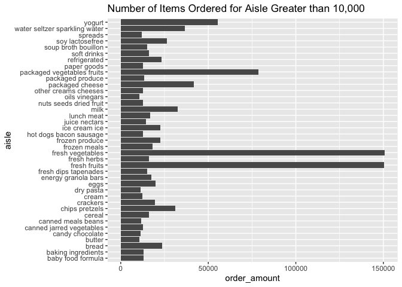

hw3\_jhk2201
================
joseph Kim
10/18/2021

### Problem 1 (Description of Instacart Data)

## How many aisles are there, and which aisles are the most items ordered from?

``` r
max(instacart$aisle_id)
```

    ## [1] 134

``` r
instacart1 <- instacart %>%
  group_by(aisle) %>% 
  summarise(order_amount=n()) %>% 
  arrange(desc(order_amount)) 
```

There are 134 total aisles listed in the dataframe. The aisle with the
most items ordered from was fresh vegetables which had a count of
150609.

``` r
instacart2 <- filter(instacart1, order_amount>10000) %>% 
arrange(desc(order_amount)) 

ggplot(instacart2, aes(x = aisle, y = order_amount)) + geom_bar(stat="Identity") +
coord_flip() + labs(title = "Number of Items Ordered for Aisle Greater than 10,000")
```

<!-- -->

``` r
instacart %>%
      filter(aisle %in% c("baking ingredients", "dog food care", "packaged vegetables fruits")) %>%
      group_by(aisle, product_name) %>%
      summarize(amount_product = n()) %>%
      arrange(aisle, desc(amount_product)) %>%
      filter(min_rank(desc(amount_product)) <4) %>%
      knitr::kable(digits = 1, caption = "The Top Three Most Popular Items Sold in ")
```

    ## `summarise()` has grouped output by 'aisle'. You can override using the `.groups` argument.

| aisle                      | product\_name                                 | amount\_product |
|:---------------------------|:----------------------------------------------|----------------:|
| baking ingredients         | Light Brown Sugar                             |             499 |
| baking ingredients         | Pure Baking Soda                              |             387 |
| baking ingredients         | Cane Sugar                                    |             336 |
| dog food care              | Snack Sticks Chicken & Rice Recipe Dog Treats |              30 |
| dog food care              | Organix Chicken & Brown Rice Recipe           |              28 |
| dog food care              | Small Dog Biscuits                            |              26 |
| packaged vegetables fruits | Organic Baby Spinach                          |            9784 |
| packaged vegetables fruits | Organic Raspberries                           |            5546 |
| packaged vegetables fruits | Organic Blueberries                           |            4966 |

The Top Three Most Popular Items Sold in
