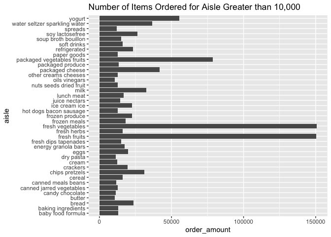
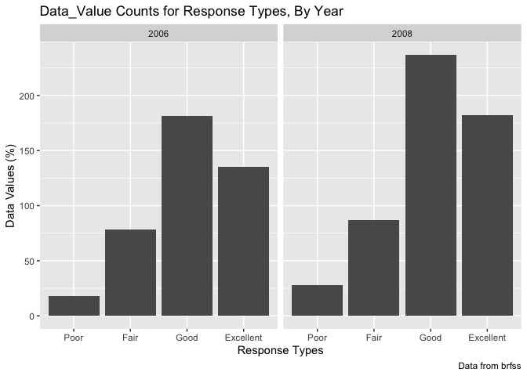
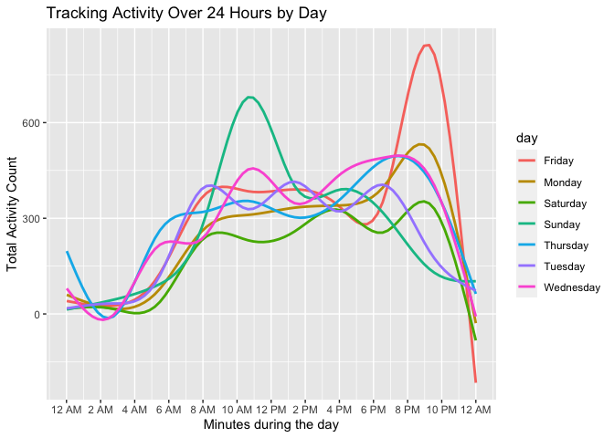

hw3\_jhk2201
================
joseph Kim
10/18/2021

### Problem 1 (Description of Instacart Data)

###### How many aisles are there, and which aisles are the most items ordered from?

``` r
max(instacart$aisle_id)
```

    ## [1] 134

``` r
instacart1 <- instacart %>%
  group_by(aisle) %>% 
  summarise(order_amount=n()) %>% 
  arrange(desc(order_amount)) 
```

There are 134 total aisles listed in the dataframe. The aisles with the
most items ordered from were fresh vegetables, fresh fruits, and
packaged vegetables/fruits.

------------------------------------------------------------------------

###### Make a plot that shows the number of items ordered in each aisle, limiting this to aisles with more than 10000 items ordered. Arrange aisles sensibly, and organize your plot so others can read it.

``` r
instacart2 <- filter(instacart1, order_amount>10000) %>% 
arrange(desc(order_amount)) 

ggplot(instacart2, aes(x = aisle, y = order_amount)) + geom_bar(stat="Identity") +
coord_flip() + labs(title = "Number of Items Ordered for Aisle Greater than 10,000")
```

<!-- -->

This plot shows the number of items ordered for each aisle that had
greater than 10,000 items ordered. We see that the vegetables and fruits
were by far the aisle in which most items were ordered from.

------------------------------------------------------------------------

###### Make a table showing the three most popular items in each of the aisles “baking ingredients”, “dog food care”, and “packaged vegetables fruits”. Include the number of times each item is ordered in your table.

``` r
instacart %>%
      filter(aisle %in% c("baking ingredients", "dog food care", "packaged vegetables fruits")) %>%
      group_by(aisle, product_name) %>%
      summarize(amount_product = n()) %>%
      arrange(aisle, desc(amount_product)) %>%
      filter(min_rank(desc(amount_product)) <4) %>%
      knitr::kable(digits = 1, caption = "The Top Three Most Popular Items Sold in ")
```

    ## `summarise()` has grouped output by 'aisle'. You can override using the `.groups` argument.

| aisle                      | product\_name                                 | amount\_product |
|:---------------------------|:----------------------------------------------|----------------:|
| baking ingredients         | Light Brown Sugar                             |             499 |
| baking ingredients         | Pure Baking Soda                              |             387 |
| baking ingredients         | Cane Sugar                                    |             336 |
| dog food care              | Snack Sticks Chicken & Rice Recipe Dog Treats |              30 |
| dog food care              | Organix Chicken & Brown Rice Recipe           |              28 |
| dog food care              | Small Dog Biscuits                            |              26 |
| packaged vegetables fruits | Organic Baby Spinach                          |            9784 |
| packaged vegetables fruits | Organic Raspberries                           |            5546 |
| packaged vegetables fruits | Organic Blueberries                           |            4966 |

The Top Three Most Popular Items Sold in

The table produced shows the top three products from the aisles “baking
ingredients”, “dog food care”, and “packaged vegetables fruits”. The
product name and the amount of each product sold is listed.

------------------------------------------------------------------------

###### Make a table showing the mean hour of the day at which Pink Lady Apples and Coffee Ice Cream are ordered on each day of the week; format this table for human readers (i.e. produce a 2 x 7 table).

``` r
mean_hours = instacart %>%
  filter(product_name %in% c("Pink Lady Apples", "Coffee Ice Cream")) %>%
  group_by(product_name, order_dow) %>%
  summarize(mean_hour_order = mean(order_hour_of_day)) %>%
  pivot_wider(names_from = order_dow, values_from = mean_hour_order) %>%
  rename(Sunday = "0", Monday = "1", Tuesday = "2", Wednesday = "3", Thursday = "4", Friday = "5", Saturday = "6") %>% 
  knitr::kable()
```

    ## `summarise()` has grouped output by 'product_name'. You can override using the `.groups` argument.

``` r
mean_hours
```

| product\_name    |   Sunday |   Monday |  Tuesday | Wednesday | Thursday |   Friday | Saturday |
|:-----------------|---------:|---------:|---------:|----------:|---------:|---------:|---------:|
| Coffee Ice Cream | 13.77419 | 14.31579 | 15.38095 |  15.31818 | 15.21739 | 12.26316 | 13.83333 |
| Pink Lady Apples | 13.44118 | 11.36000 | 11.70213 |  14.25000 | 11.55172 | 12.78431 | 11.93750 |

------------------------------------------------------------------------

### Problem 2

##### Data cleaning the BRFSS dataset

``` r
data("brfss_smart2010")

behavioral_health = brfss_smart2010 %>%
    janitor::clean_names() %>%
    filter(topic == "Overall Health") %>%
    filter(response %in% c("Excellent", "Very Good", "Good", "Fair", "Poor")) %>%
    mutate(response = as.factor(response)) %>%
    mutate(response = forcats::fct_relevel(response, c("Poor", "Fair", "Good", "Very good", "Excellent")))
```

    ## Warning: Unknown levels in `f`: Very good

``` r
behavioral_health
```

    ## # A tibble: 8,500 × 23
    ##     year locationabbr locationdesc  class  topic  question  response sample_size
    ##    <int> <chr>        <chr>         <chr>  <chr>  <chr>     <fct>          <int>
    ##  1  2010 AL           AL - Jeffers… Healt… Overa… How is y… Excelle…          94
    ##  2  2010 AL           AL - Jeffers… Healt… Overa… How is y… Good             208
    ##  3  2010 AL           AL - Jeffers… Healt… Overa… How is y… Fair             107
    ##  4  2010 AL           AL - Jeffers… Healt… Overa… How is y… Poor              45
    ##  5  2010 AL           AL - Mobile … Healt… Overa… How is y… Excelle…          91
    ##  6  2010 AL           AL - Mobile … Healt… Overa… How is y… Good             224
    ##  7  2010 AL           AL - Mobile … Healt… Overa… How is y… Fair             120
    ##  8  2010 AL           AL - Mobile … Healt… Overa… How is y… Poor              66
    ##  9  2010 AL           AL - Tuscalo… Healt… Overa… How is y… Excelle…          58
    ## 10  2010 AL           AL - Tuscalo… Healt… Overa… How is y… Good             171
    ## # … with 8,490 more rows, and 15 more variables: data_value <dbl>,
    ## #   confidence_limit_low <dbl>, confidence_limit_high <dbl>,
    ## #   display_order <int>, data_value_unit <chr>, data_value_type <chr>,
    ## #   data_value_footnote_symbol <chr>, data_value_footnote <chr>,
    ## #   data_source <chr>, class_id <chr>, topic_id <chr>, location_id <chr>,
    ## #   question_id <chr>, respid <chr>, geo_location <chr>

After data was cleaned, the resulting data frame had 8500 rows and 23
columns.

------------------------------------------------------------------------

##### In 2002, which states were observed at 7 or more locations? What about in 2010?

``` r
data("brfss_smart2010")

behavioral_health2002 = behavioral_health %>%
  filter(year == 2002) %>%
  group_by(locationabbr) %>%
  summarize(count = n_distinct(locationdesc)) %>%
  filter(count >= 7) %>%
  knitr::kable()

behavioral_health2002
```

| locationabbr | count |
|:-------------|------:|
| CT           |     7 |
| FL           |     7 |
| MA           |     8 |
| NC           |     7 |
| NJ           |     8 |
| PA           |    10 |

``` r
behavioral_health2010 = behavioral_health %>%
  filter(year == 2010) %>%
  group_by(locationabbr) %>%
  summarize(count = n_distinct(locationdesc)) %>%
  filter(count >= 7) %>%
  knitr::kable()

behavioral_health2010
```

| locationabbr | count |
|:-------------|------:|
| CA           |    12 |
| CO           |     7 |
| FL           |    41 |
| MA           |     9 |
| MD           |    12 |
| NC           |    12 |
| NE           |    10 |
| NJ           |    19 |
| NY           |     9 |
| OH           |     8 |
| PA           |     7 |
| SC           |     7 |
| TX           |    16 |
| WA           |    10 |

In 2002, there were six states that were observed at 7 or more locations
(CT, FL, MA, NC, NJ, PA). In 2021, there were 14 states that fit the
above criteria (CA, CO, FL, MA, MD, NC, NE, NJ, NY , OH, PA, SC, TX,
WA).

------------------------------------------------------------------------

###### Make a “spaghetti” plot of this average value over time within a state.

``` r
behave_excellent = behavioral_health %>%
  filter(response == "Excellent") %>%
  group_by(year, locationabbr) %>%
  summarize(avg_datavalue = mean(data_value, na.rm = TRUE)) 
```

    ## `summarise()` has grouped output by 'year'. You can override using the `.groups` argument.

``` r
ggplot(behave_excellent, aes(x = year, y = avg_datavalue, color = locationabbr)) + geom_line(aes(group = locationabbr), alpha =0.5) + labs(
    title = "Avergae Data Value Over Time By State",
    x = "Year",
    y = "Average Data Value",
    caption = "Data from brfss"
  )
```

<!-- -->

The resulting spaghetti plot shows the change in average data value over
time for each state. It appears very chaotic, and the data varies from
state to state.

------------------------------------------------------------------------

###### Make a two-panel plot showing, for the years 2006, and 2010, distribution of data\_value for responses (“Poor” to “Excellent”) among locations in NY State.

``` r
plot_data = behavioral_health %>%
  filter(locationabbr == "NY") %>%
  filter(year %in% c("2006", "2008"))
  
ggplot(plot_data, aes(x=response, y=data_value)) + 
  geom_col() + facet_grid(~year) + labs(
    title = "Data_Value Counts for Response Types, By Year",
    x = "Response Types",
    y = "Data Values (%)",
    caption = "Data from brfss") 
```

<!-- -->

The two paneled bar graphs produced shows the data value counts for
response types separated by year (2006, 2008). More Good and Excellent
response types are present in 2008 than in 2006.

------------------------------------------------------------------------

### Problem 3

###### Load, Clean, and Wrangle Data

``` r
accelerometer_df=
  read_csv("/Users/josephkim/Desktop/p8106_hw3_jhk2201/accel_data.csv") %>%
  janitor::clean_names() %>%
    pivot_longer(
    activity_1:activity_1440,
    names_to = "minute_count", 
    values_to = "activity_count",
    names_prefix = "activity_") %>%
    mutate(
      week = as.integer(week), 
      day_id = as.integer(day_id), 
      minute_count = as.integer(minute_count), 
      weekend_weekday = case_when(
           day %in% c("Monday", "Tuesday", "Wednesday", "Thursday", "Friday") ~ "Weekday",
           day %in% c("Saturday", "Sunday") ~ "Weekend")) %>%
      relocate(weekend_weekday,.after = day)
```

    ## Rows: 35 Columns: 1443

    ## ── Column specification ────────────────────────────────────────────────────────
    ## Delimiter: ","
    ## chr    (1): day
    ## dbl (1442): week, day_id, activity.1, activity.2, activity.3, activity.4, ac...

    ## 
    ## ℹ Use `spec()` to retrieve the full column specification for this data.
    ## ℹ Specify the column types or set `show_col_types = FALSE` to quiet this message.

The accelerometer data after tidying produced 50400 observations with 6
variables. Those variables include week, day\_id, day, weekend\_weekday,
minute\_count, and activity\_count. We created the weekend\_weekday was
created with a case\_when statement.

------------------------------------------------------------------------

###### Using your tidied dataset, aggregate accross minutes to create a total activity variable for each day, and create a table showing these totals. Are any trends apparent?

``` r
agg.accel_df = accelerometer_df %>%
  group_by(week, day) %>%
  summarize(total_activity = sum(activity_count)) %>%
  knitr::kable(caption = "Total Activity Per Day of the Week")
```

    ## `summarise()` has grouped output by 'week'. You can override using the `.groups` argument.

``` r
agg.accel_df
```

| week | day       | total\_activity |
|-----:|:----------|----------------:|
|    1 | Friday    |       480542.62 |
|    1 | Monday    |        78828.07 |
|    1 | Saturday  |       376254.00 |
|    1 | Sunday    |       631105.00 |
|    1 | Thursday  |       355923.64 |
|    1 | Tuesday   |       307094.24 |
|    1 | Wednesday |       340115.01 |
|    2 | Friday    |       568839.00 |
|    2 | Monday    |       295431.00 |
|    2 | Saturday  |       607175.00 |
|    2 | Sunday    |       422018.00 |
|    2 | Thursday  |       474048.00 |
|    2 | Tuesday   |       423245.00 |
|    2 | Wednesday |       440962.00 |
|    3 | Friday    |       467420.00 |
|    3 | Monday    |       685910.00 |
|    3 | Saturday  |       382928.00 |
|    3 | Sunday    |       467052.00 |
|    3 | Thursday  |       371230.00 |
|    3 | Tuesday   |       381507.00 |
|    3 | Wednesday |       468869.00 |
|    4 | Friday    |       154049.00 |
|    4 | Monday    |       409450.00 |
|    4 | Saturday  |         1440.00 |
|    4 | Sunday    |       260617.00 |
|    4 | Thursday  |       340291.00 |
|    4 | Tuesday   |       319568.00 |
|    4 | Wednesday |       434460.00 |
|    5 | Friday    |       620860.00 |
|    5 | Monday    |       389080.00 |
|    5 | Saturday  |         1440.00 |
|    5 | Sunday    |       138421.00 |
|    5 | Thursday  |       549658.00 |
|    5 | Tuesday   |       367824.00 |
|    5 | Wednesday |       445366.00 |

Total Activity Per Day of the Week

The trends being aboved based on the table is that total daily activity
is slower at the beginning of the week (Monday) and increases towards
the weekend. This is not that consistent as you look through the weeks.

------------------------------------------------------------------------

###### Make a single-panel plot that shows the 24-hour activity time courses for each day and use color to indicate day of the week.

``` r
plot_data3 = accelerometer_df %>%
  group_by(day, minute_count)
  
ggplot(plot_data3, aes(x=minute_count, y=activity_count, color = day)) +
  geom_smooth(se = FALSE) + 
  labs(
   title = "Tracking Activity Over 24 Hours by Day",
    x = "Minutes during the day",
    y = "Total Activity Count") +
  scale_x_continuous(
    breaks = c(0, 120, 240, 360, 480, 600, 720, 840, 960, 1080, 1200, 1320, 1440), 
    labels = c("12 AM", "2 AM", "4 AM", "6 AM", "8 AM", "10 AM", "12 PM", "2 PM", "4 PM", "6 PM", "8 PM", "10 PM", "12 AM"))
```

    ## `geom_smooth()` using method = 'gam' and formula 'y ~ s(x, bs = "cs")'

<!-- -->

Some apparent information from this plot is that there is an observed
spike in activity during the mid day on Sundays. Additionally, we
observe another spike on Friday from 7-9 pm, which could be when an
individual may begin to enjoy their weekend after a week of work.
